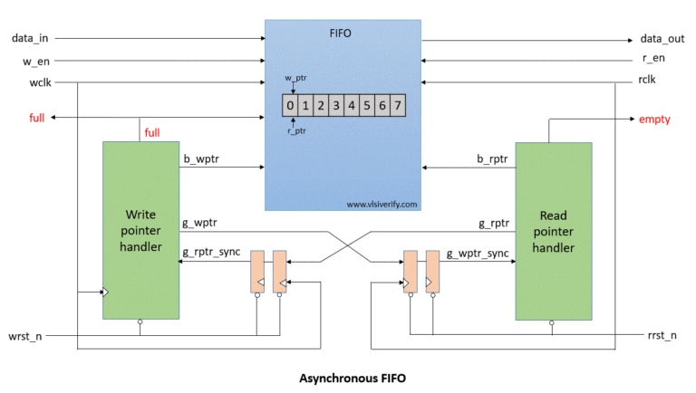

# Asynchronous FIFO (Async FIFO)

## 1. Introduction

An **Asynchronous FIFO (First-In First-Out)** is a hardware buffer used to safely transfer data between **two different clock domains**:
- **Write clock domain (`wr_clk`)**
- **Read clock domain (`rd_clk`)**

These clocks are **independent and asynchronous** (no fixed phase or frequency relationship).  
Async FIFOs are widely used in **CDC (Clock Domain Crossing)** designs such as:
- SoC interconnects
- High-speed interfaces
- DSP pipelines
- Network routers
- Memory subsystems

---

## 2. Why Async FIFO is Needed

Directly passing data between two unrelated clocks can cause:
- **Metastability**
- **Data corruption**
- **Unpredictable hardware failures**

Async FIFO provides:
- Safe data transfer
- Flow control (FULL / EMPTY)
- Clock domain isolation

---

## 3. Basic Architecture
## Async FIFO Architecture

<!-- <p align="center">
  
  <br>
  <em>Asynchronous FIFO with Gray-coded pointer synchronization</em>
</p> -->

---


## 4. Metastability (Core Problem)

### What is Metastability?

Metastability occurs when a **flip-flop samples a signal that changes near its clock edge**, violating setup or hold time.

Result:
- Output may temporarily stay at an undefined voltage
- Eventually resolves to `0` or `1`
- Can propagate errors in control logic

⚠️ Metastability is a **hardware phenomenon**, not a simulation issue.

---

## 5. Why Metastability Occurs in Async FIFO

In async FIFO:
- Write pointer is generated in `wr_clk`
- Read logic samples it in `rd_clk`
- Read pointer is generated in `rd_clk`
- Write logic samples it in `wr_clk`

These **pointer signals cross clock domains**, making them susceptible to metastability.

---

## 6. Why Only Pointers Cross Clock Domains

| Signal | Reason |
|------|------|
| Data | Stored in dual-port RAM (safe for async access) |
| Pointers | Needed for FULL/EMPTY detection |
| Flags | Derived from pointers |

👉 Data never directly crosses domains  
👉 Only **control pointers** cross domains

---

## 7. Why Binary Pointers Are Unsafe

Binary counters can change **multiple bits at once**:
0111 → 1000 (4 bits toggle)


If sampled asynchronously:
- Different bits may be captured at different times
- Invalid pointer values may be observed
- FULL/EMPTY logic breaks

❌ Synchronizers alone cannot fix multi-bit incoherency.

---

## 8. Why Gray Code Is Used

### Gray Code Property

> **Only one bit changes between consecutive values**

Example: 
Binary: 011 → 100
Gray: 010 → 110 (1 bit changes)


### Benefit in Async FIFO
- At most **one bit can be metastable**
- Other bits remain stable
- Synchronized value is always:
  - Old pointer OR
  - New pointer
- Never an illegal value

✔️ This makes multi-bit pointer synchronization safe.

---

## 9. Pointer Increment Location

Each pointer is incremented **only in its own clock domain**:

| Pointer | Increment Clock |
|------|----------------|
| Write pointer (`wptr`) | `wr_clk` |
| Read pointer (`rptr`) | `rd_clk` |

Example:
```verilog
// Write domain
if (wr_en && !full)
    wptr_bin <= wptr_bin + 1;

// Read domain
if (rd_en && !empty)
    rptr_bin <= rptr_bin + 1;
